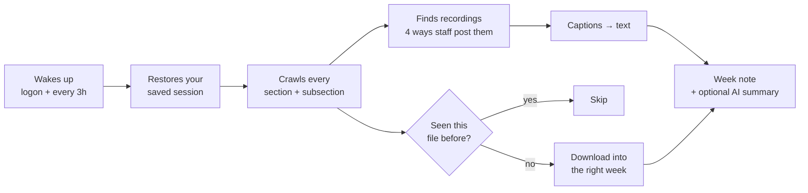

# Moodle Downloader

**English** | [简体中文](README.zh-CN.md)


**Your unit's files, filed into week folders, by themselves, all semester.**
Lecture recordings become readable transcripts, so a week's material is text
you can search, skim, or paste into a chatbot.

> **Built for Monash University students.** It is written against Monash's
> Moodle, Panopto and single sign-on. Other universities are out of scope —
> the course structure it understands is Monash's custom one.


---

## What it actually does

You click once. From then on, this happens on its own:

| | What you get | Set-up needed |
| :-- | :-- | :-- |
| 📂 **Files** | Every slide, worksheet, reading and solution, filed into `Week 00` – `Week 12` | none |
| 🕐 **Late files** | Tutorial solutions posted three days after class arrive by themselves | none |
| 📝 **Assignments** | Briefs and rubrics per assignment, plus an index of every assessment with due dates | none |
| 🎧 **Transcripts** | Lecture recordings turned into readable text — no video downloaded | none |
| 📊 **Grades** | A running total per unit: what you scored, what it was worth, what is left, and what you still need for a D or an HD | none |
| 🗒️ **Weekly notes** | A `Week NN Summary` telling you **what happened this week** — what landed, what was recorded, what's due next | none |
| 🤖 **AI summaries** | A revision-ready summary on top of each transcript | one API key ([see below](#ai-summaries--optional)) |
| 🔒 **Your password** | Never seen by the app. Login happens on Monash's own page | none |

**Nothing is ever downloaded twice.** Delete a file by accident and it comes
back next sync. Move the app and your settings follow.

---

## What one sync does



It runs with no window and no notification. You only ever see it if your
Monash login genuinely expired.

---

## Getting started — Windows, nothing to install

1. **Download** `MoodleDownloader.exe` from [Releases](../../releases) and put
   it anywhere. Windows will warn about an unknown publisher — that is normal
   for free unsigned software. Choose **More info → Run anyway**.
2. **Open it**, pick where files should go, then click **Load my courses from
   Moodle**. Log in when the browser window appears, and tick
   **"Keep me signed in"** so this rarely happens again.
3. **Tick your units** → **Finish and run first sync**.
4. **Leave Auto-sync on.** That's it. New files arrive on their own.


> Your password is typed only into Monash's own login page. There is no
> server, no account, and no telemetry. Session cookies stay on your machine
> in `%LOCALAPPDATA%\moodle-downloader`.

---

## What you end up with

```
Your folder/
├── FIT5129/
│   ├── Week 00 … Week 12/
│   │   ├── lecture slides, worksheets, solutions …
│   │   ├── Week 02 Summary.docx      ← what happened this week
│   │   └── Transcripts/              ← lecture recordings as text
│   ├── Assignments/                  ← briefs, rubrics + assessment index
│   └── _Other/                       ← anything that matched no week
└── FIT5136/
    └── …
```

| | |
| :-- | :-- |
|  |  |
| Every unit gets `Week 00`–`Week 12`, `Assignments` and `_Other`, kept current. | Each assignment gets its own folder — staff attachments only, never your submissions. |

### The weekly note answers one question: what happened this week?


Open a unit after a week away and the honest question is not *"what does this
material say?"* — it's *"what changed, and what have I missed?"* That is what
this note answers: which files landed, which lectures were recorded, and what
is due next.

> **It deliberately does not summarise the content.**
> Reading and condensing every file would burn through an API allowance fast,
> and you almost certainly already have a tool you like for that — so the note
> stays a factual record and leaves the thinking to you. It saves you the time,
> not the study.

The note is rewritten on every sync, so keep your own notes in a different file.

---

## AI summaries — optional

**Everything above works with no API key and nothing sent anywhere.** Leave
this off and the feature does not appear at all.

### What a key buys you

1. **A summary on top of every transcript** — thorough enough to revise from,
   not a teaser. Every topic covered gets its own section.
2. **A fallback when YouTube blocks you.** YouTube rate-limits by IP address.
   When that happens, Gemini can read the video from Google's side instead —
   so the transcript still arrives.

### Which one to pick

| If you… | Choose | Why |
| :-- | :-- | :-- |
| just want it free | **Gemini** | Google's free tier is the most generous, and it is this tool's default |
| want nothing leaving your PC | **Ollama** | Runs locally. No key, no cost, no data ever leaves the machine |
| already pay for ChatGPT / Claude API | **OpenAI** / **Anthropic** | No new account to open |
| are on a mainland-China network | **DeepSeek**, **GLM**, **Qwen**, **Kimi** | Reachable without a VPN, and cheap |

Pick the provider and paste the key in the setup screen. Nothing else to configure.

### What it costs

Here is the honest arithmetic, so you can judge it yourself:

| | Typical semester |
| :-- | :-- |
| Units | 4 |
| Recordings transcribed | ~100 |
| API calls | ~100 (one per recording) |
| Tokens in | ~1,000,000 (a lecture transcript is ~9k tokens) |
| Tokens out | ~200,000 |

At Gemini 2.5 Flash-Lite's published rate of **$0.10 per million input** and
**$0.40 per million output**, that works out to roughly **$0.20 for the whole
semester** — and on the free tier, nothing at all. The tool paces itself to
6 seconds between calls, so ~100 requests spread over a semester sits well
inside free-tier limits.

> Prices move, and models get retired. Check the official page before you
> commit to a paid tier:
> [Gemini](https://ai.google.dev/gemini-api/docs/pricing) ·
> [OpenAI](https://openai.com/api/pricing/) ·
> [Anthropic](https://www.anthropic.com/pricing) ·
> [DeepSeek](https://api-docs.deepseek.com/quick_start/pricing) ·
> [Moonshot / Kimi](https://platform.moonshot.cn/docs/pricing) ·
> [Zhipu GLM](https://open.bigmodel.cn/pricing) ·
> [Qwen](https://help.aliyun.com/zh/model-studio/billing-for-model-studio)

Your key is stored in your own config file and is only ever sent to the
provider it belongs to.

---

## Grades — where the numbers actually come from

Moodle's grade report at Monash shows four columns: item, mark, range,
feedback. **No weight, no contribution, no course total** — they are turned
off in every unit checked. So "am I passing?" is a question the gradebook
cannot answer, and the app rebuilds the answer from three sources.

| Source | What it knows |
| :-- | :-- |
| The gradebook | What you scored, and out of what |
| The unit's own PDFs | What each piece is worth — the week 1 overview usually states the whole scheme |
| You | Everything neither of them says |

**Reading the range is the whole trick.** A bare `21` means nothing: out of 25
it is a good mark, out of 100 it is a disaster. Every figure is
`score ÷ range × weight`, so both styles come out right.

**Where weights come from, in order.** A document that states the scheme beats
a name that happens to carry a number, and both beat the range. Whatever is
used is printed under the row, so you can check it:

```
Individual Assignment 1                      13.80 / 20%
     weight from FIT5234 Applied Week 1 - Unit Overview (updated).pdf p8
```

**It says when it does not know.** If the weights do not add to 100%, the page
says so and names what is missing rather than quietly dividing by the wrong
number. A unit that states nothing anywhere stays blank until you fill it in.

### The part Moodle cannot tell you

One real unit's overview says the quiz block is `10% (2.5% * 4)` — four
quizzes. Moodle has created **three**. Count the quizzes in the gradebook and
every figure is wrong until November. So the app reads the four out of the
slide, shows three real quizzes and one empty slot, and counts only the ones
that have been marked.

The same applies to `best 8 of 10` rules: nothing is ever dropped silently.
Set **counts** on the block and the arithmetic follows; leave it and every
quiz counts.

### Everything on the page is editable

Open **Grades** in the app. Change any weight or mark and the totals move as
you type; press **Save** to keep them. A field you have edited is yours — no
later sync overwrites it. You can add an assessment that is not in Moodle
yet, untick one that does not count, and set a target:

> need 69.4% average on the remaining 77.5%

When a mark appears, you get a desktop notification and a line in that week's
note. The sheet lives in `%LOCALAPPDATA%\moodle-downloader\grades.json` and
is never uploaded anywhere.

---

## When something can't be done, it says so

Silent skipping is how bugs stay invisible, so every recording that produces
no transcript is named in the week note **with a reason** — and the reason
tells you whether it is worth waiting for:

| What you'll read | Meaning | Will it retry? |
| :-- | :-- | :-- |
| has no captions | genuinely none — e.g. a Zoom cloud recording | no, that's final |
| only Gemini can watch a recording itself | no captions, and your AI provider can't watch video | no — but switching to Gemini fetches it |
| the platform is rate-limiting us | YouTube blocked our address for now | yes, next sync |
| could not be reached | network or platform hiccup | yes, next sync |
| needs you to sign in to the video platform | Panopto wants one more sign-on | yes, next sync |
| queued for the next sync | held back on purpose, to stay under YouTube's limits | yes, next sync |

---

## What you can change

Courses, download folder, sync interval and the AI provider are all in the app
window. Everything else lives in one `config.yaml`, kept per-user at
`%LOCALAPPDATA%\moodle-downloader\` — so replacing or moving the app never
loses your settings.

| Setting | What it does | Default |
| :-- | :-- | :-- |
| `root_dir` | Where course files are saved | `./MoodleFiles` |
| `course_selection` | `manual` (fixed list) or `starred` (follows your Moodle stars) | `manual` |
| `sync_interval_hours` | How often auto-sync runs | `3` |
| `section_patterns` | Regexes matching a section title to a week — add `"module\s*0*{week}\b"` if your unit says "Module 3" | Week / Topic |
| `assignments_folder` | Set to `""` to skip assignments entirely | `Assignments` |
| `weekly_notes` | `false` turns off the weekly summary notes | `true` |
| `transcripts` | `false` turns off caption downloads | `true` |
| `track_grades` | `false` stops the app reading your gradebook at all | `true` |
| `note_formats` | Output formats — `docx`, `txt`, `md` | `docx`, `txt` |
| `max_youtube_per_sync` | YouTube caption fetches allowed **per sync, across all units** | `8` |
| `ai_provider` / `ai_api_key` | Optional AI summaries | off |

> **Why Word and not Markdown?** Most people have never opened a `.md` file,
> and every chatbot accepts `.docx` and `.txt`. Markdown is available but off.

---

## FAQ

**A browser window opened and asked me to log in.**
Your saved session expired. Log in there and the sync carries on by itself.
Don't close the window.

**My unit says "Module 3" instead of "Week 3".**
Add a pattern to `section_patterns` in `config.yaml`.

**Files went into `_Other/`.**
That section's title matched no week pattern — same fix as above.

**I moved the exe and auto-sync stopped.**
Turn Auto-sync off and on again to re-register the new location.

**Is this allowed?**
It downloads material from units you are enrolled in, through your own login,
for your own study — the same files you could click one at a time.

---

## Developers · macOS · Linux

Requires Python 3.10+.

```bash
pip install -r requirements.txt
python run.py            # GUI
python run.py sync       # headless sync, for cron or Task Scheduler
python tests/uat.py      # 66 acceptance checks — no network, touches nothing real
```

It drives a real browser through Playwright, using system Edge or Chrome when
available; otherwise run `playwright install chromium` once. macOS and Linux
should work but are not regularly tested.

Build the Windows executable:

```bash
pyinstaller MoodleDownloader.spec --noconfirm
```

`docs/maintainer-notes.md` records the findings behind the crawler, the
caption pipeline and the AI handling — read it before changing any of them.

---

## License

MIT
